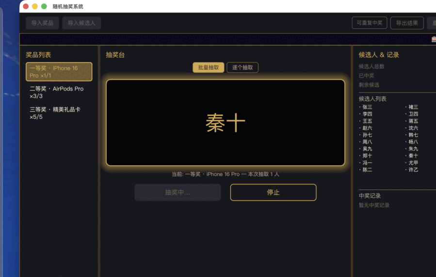

# random_lottery · 随机抽奖系统

一款跨平台桌面抽奖应用，使用 Rust + [iced](https://iced.rs/) 构建。支持 Excel / CSV / TXT 导入奖品与候选人，批量或逐个抽取，Midnight Champagne 风格的暗金配色。



## 特性

- **多格式导入**：奖品与候选人支持 `.xlsx` / `.xls` / `.ods` / `.csv` / `.txt`
- **两种抽取模式**：批量（按奖品剩余名额一次抽满）、逐个（单人单抽）
- **防重复中奖**：默认一人一奖；可开关「允许重复中奖」
- **中奖合并显示**：同一奖项多次抽取的中奖人自动合并到同一 section
- **导出结果**：Excel / CSV / TXT
- **跑马灯 & 滚动动画**：Canvas 绘制，GPU 渲染
- **跨平台**：macOS / Linux（wgpu）/ Windows（tiny-skia 软渲染，便于交叉编译）
- **中文友好**：内嵌 Noto Sans SC，Windows 回退 Microsoft YaHei，Linux 回退 Noto Sans CJK SC

## 快速开始

### 二进制下载

前往 [Releases](https://github.com/0xYeah/random_lottery/releases) 下载对应平台的压缩包解压即用。

### 从源码构建

```bash
git clone https://github.com/0xYeah/random_lottery.git
cd random_lottery
cargo run --release
```

开发构建：

```bash
cargo run
```

交叉编译 Windows（需 `zig` + `cargo-zigbuild`）：

```bash
./build.sh
```

## 使用流程

1. **导入奖品** — 点击工具栏「导入奖品」，选择奖品文件
2. **导入候选人** — 点击「导入候选人」，选择名单文件
3. **选择奖项** — 左侧奖品列表单击选中
4. **选择模式** — 中央面板切换「批量抽取 / 逐个抽取」
5. **开始抽奖** — 点击「开始抽奖」；`停止` 可提前终止（不记录）
6. **查看 / 导出** — 右侧面板实时显示中奖记录；工具栏「导出结果」落盘

工具栏额外操作：

- **可重复中奖** — 开启后同一人可多次中奖
- **重置** — 清空所有中奖记录、恢复奖品名额与候选人状态

## 文件格式

示例见 [`example_files/`](example_files/)。

### 奖品

| 列 1 | 列 2 |
|------|------|
| 奖品名称 | 数量 |

- **TXT**：每行 `奖品名 数量`（空白/制表符分隔），`#` 开头为注释
- **CSV**：`奖品名,数量`
- **Excel**：第一行可为标题，后续每行一奖品

```
一等奖 1
二等奖 3
三等奖 5
```

### 候选人

| 列 1 | 列 2（可选） |
|------|-------------|
| 姓名 | 工号 / ID |

- **TXT**：每行一个姓名
- **CSV**：`姓名` 或 `姓名,ID`
- **Excel**：第一列姓名，第二列可选 ID

```
张三
李四
王五
```

## Demo 模式

环境变量 `LOTTERY_DEMO=1` 启动内置自动演示：预载示例数据 + 脚本化依次跑完一/二/三等奖（批量 → 逐个）。用于录制 GIF / 快速演示：

```bash
LOTTERY_DEMO=1 ./target/release/random_lottery
```

窗口固定在 `(40, 40)` 位置、`1100 × 700` 尺寸，便于 `screencapture` 精确框取。

## 架构

```
src/
├── main.rs      # 入口：字体加载 + 窗口 Settings
├── app.rs       # State + Message + update loop + demo script
├── model.rs     # Prize / Candidate / WinRecord / DrawMode / DrawState
├── view.rs      # iced 视图：工具栏 / 跑马灯 / 三栏布局 / 按钮样式
├── excel.rs     # 导入：按扩展名分流 (txt/csv/xlsx via calamine)
├── export.rs    # 导出：txt/csv/xlsx via rust_xlsxwriter
└── theme.rs     # Midnight Champagne 调色板常量
```

**抽奖算法** — `src/app.rs` `Message::Tick`：`rand::thread_rng()` + `SliceRandom::shuffle` 洗牌候选池，`take(count)` 取前 N；50 tick (~4s) 后 `StopDraw` 落定。

## 开发

```bash
cargo fmt
cargo clippy -- -D warnings
cargo build --release
```

核心依赖：

| 库 | 用途 |
|----|------|
| `iced` | UI 框架 |
| `calamine` | 读 Excel / ODS |
| `rust_xlsxwriter` | 写 Excel |
| `rfd` | 原生文件对话框 |
| `rand` | 抽签洗牌 |
| `tokio` | iced 异步 runtime |

## 许可证

[MIT](LICENSE) © 2026 0xYeah
